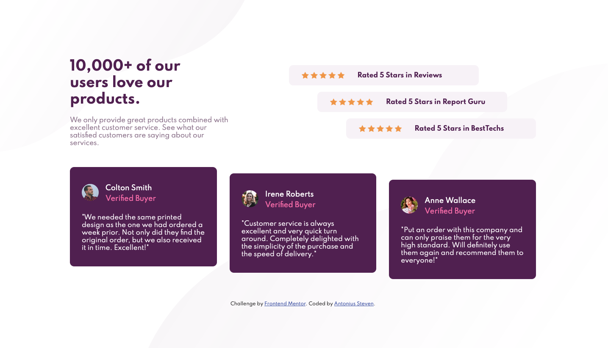

# Frontend Mentor - Social proof section solution

This is a solution to the [Social proof section challenge on Frontend Mentor](https://www.frontendmentor.io/challenges/social-proof-section-6e0qTv_bA). Frontend Mentor challenges help you improve your coding skills by building realistic projects.

## Table of contents

- [Overview](#overview)
  - [The challenge](#the-challenge)
  - [Screenshot](#screenshot)
  - [Links](#links)
- [My process](#my-process)
  - [Built with](#built-with)
  - [What I learned](#what-i-learned)
  - [Continued development](#continued-development)
  - [Useful resources](#useful-resources)
- [Author](#author)

## Overview

### The challenge

Users should be able to:

- View the optimal layout for the section depending on their device's screen size

### Screenshot

### Links

- Solution URL: [Solution](https://github.com/ASteven21/Social-Proof-Section)
- Live Site URL: [Live Web](https://asteven21.github.io/Social-Proof-Section/)

## My process

### Built with

- Semantic HTML5 markup
- CSS custom properties
- Flexbox
- Mobile-first workflow

### What I learned

- In this challenge, I learned about `background-repeat: space` to get the right number of stars for the project.

### Continued development

- I hope to be able to get better at dealing with background images since it still took me a lot of time in order to get its position right.

### Useful resources

- [Kevin Powell](https://www.youtube.com/watch?v=K27WULzr2P8&t=3412s) - I learned about `background-repeat: space` from Kevin's video about this exact same challenge.

## Author

- Website - [GitHub](https://github.com/ASteven21)
- Frontend Mentor - [@ASteven21](https://www.frontendmentor.io/profile/ASteven21)
